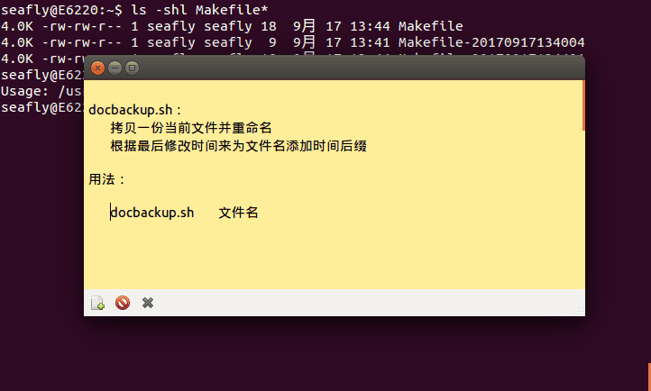
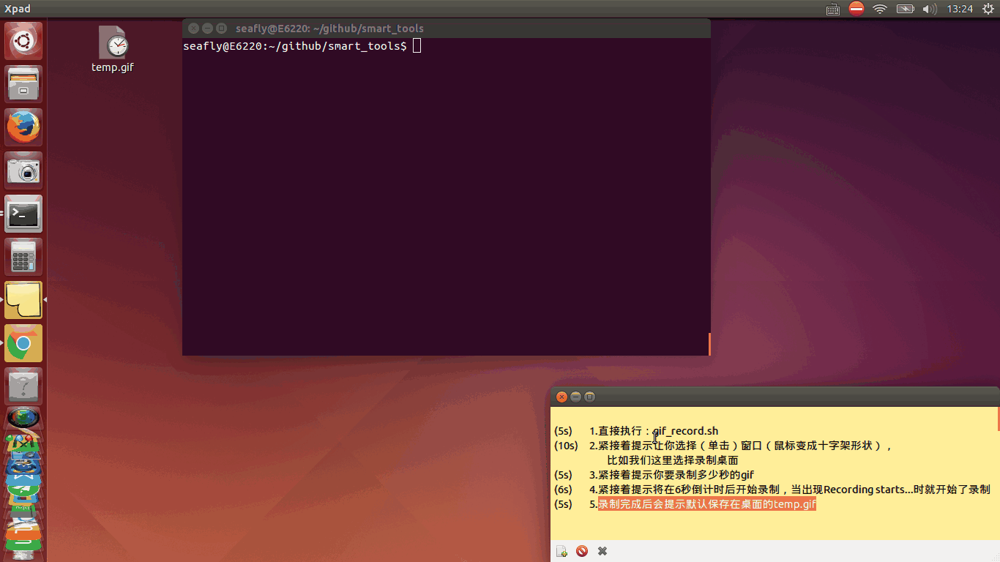
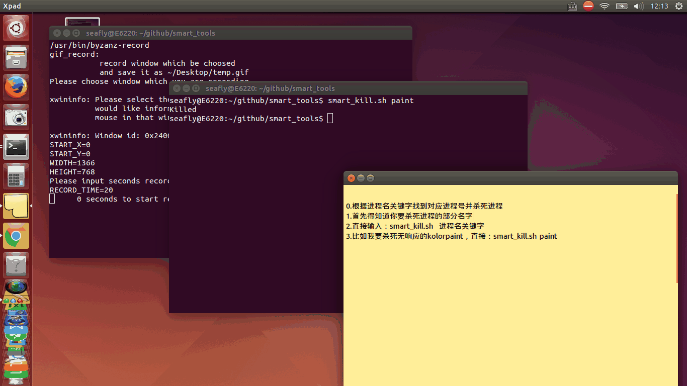

# Introduction

    - smart_tools: Practical small scripts by development of oneself.
    - platform: ubuntu x86_64

# Get smart_tools

    - `git clone -b master https://github.com/SeaflyGithub/smart_tools`

# Install smart_tools

    - `cd smart_tools/ && chmod 755 install.sh && ./install.sh`

# Introduction of tools

## docbackup.sh

    - Tip: rename destinative file with last modified time
    - Tip: example: abc.txt --> abc-20170616061606.txt
    - Use: run `docbackup.sh` for help
    - GIF: 

## gif_record.sh

    - Tip: record window which be choosed and save to ~/Desktop/temp.gif
    - Use: run `gif_record.sh` straightly.
    - GIF: 

## global_sys.sh

    - Tip: save global avairiables for other scripts in this dir
    - Use: program other scripts
    - GIF: 

## smart_kill.sh

    - Tip: kill a process with a simple way
    - Use: run `smart_kill.sh` for help.
    - GIF: 

## translate

    - Tip: YouDao dictory for command under network environment
    - Use: run `translate` or `t` for help.
    - GIF: 

